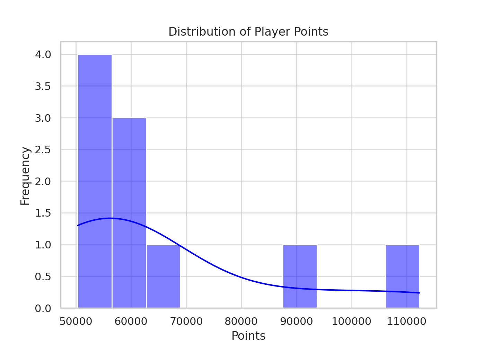
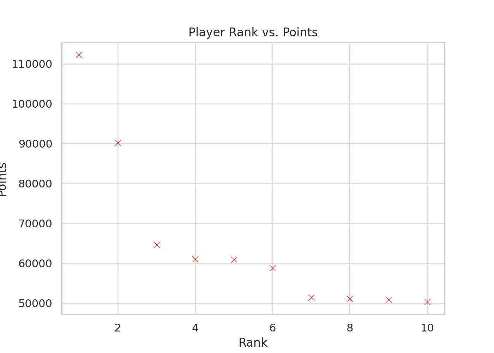
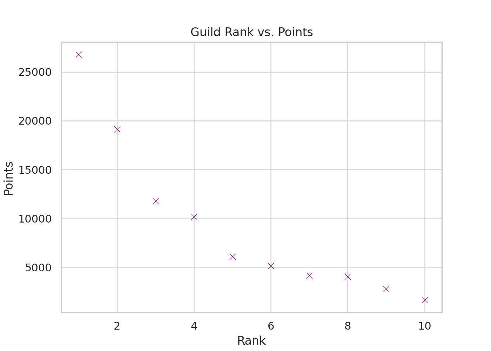
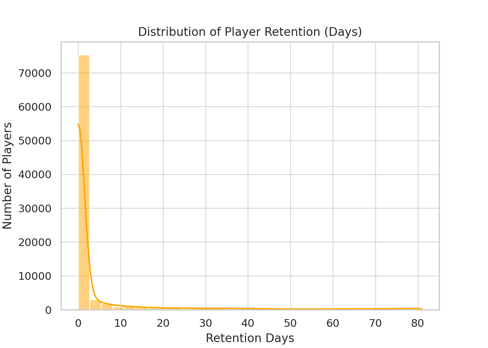

# Blocksmc Server Data Analysis

## Overview
This repository contains a comprehensive analysis of player and guild performance metrics on the Blocksmc server. The dataset provides insights into top players, guild dynamics, ranking systems, player retention, and competitive patterns.

## Visual Insights

### Player Points Distribution

*Analysis of how points are distributed across the player base, showing the concentration of points among different player segments.*

### Player Rank vs. Points

*Correlation between player rankings and their point accumulation, highlighting the exponential growth in points required for higher ranks.*

### Guild Rank vs. Points

*Comparison of guild rankings against their total point accumulation, demonstrating the competitive landscape among top guilds.*

### Player Retention Distribution

*Analysis of player retention patterns, showing the frequency of player returns and overall engagement longevity.*

## Contents
- **Analyzed_Game_Data.xlsx** - Comprehensive structured dataset containing all analyzed metrics

## Usage
- Open **Analyzed_Game_Data.xlsx** to explore the raw data and specific metrics
- Review the visualization images for quick insights into server trends
- Download SQL queries to recreate or extend the analysis with your own data

## Server Information
This analysis is based on data extracted from the **Blocksmc** server between [date range if applicable].

## Download
Here is the PublicDB SQLite file: https://gofile.io/d/gykTtj
